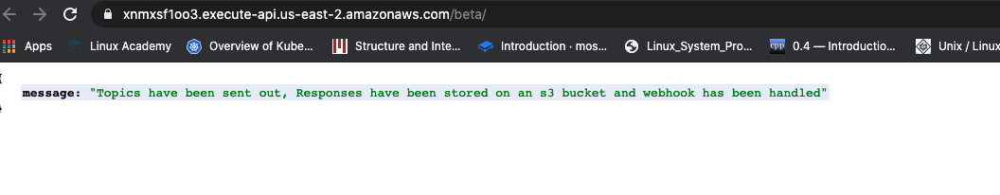
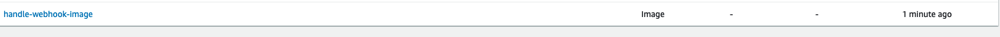
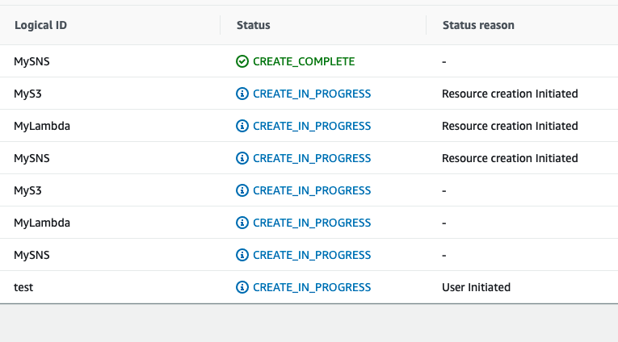
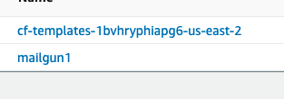

# AWS Lambda, SNS and S3 setup

## Cloud formation
The cloud formation alternative setup can be found in the `cloud-formation.json` file. 

## Lambda
The Lambda was written in TS, and was uploaded to ECR. 
The command for the upload is:
```
docker push 876208092783.dkr.ecr.us-east-2.amazonaws.com/mailgun:latest
```
It was setup using API Gateway and the URL is: 
`https://y00qimgu1j.execute-api.us-east-2.amazonaws.com/default/handle-webhooks` 

## Send Email via Mail Gun
To send an Email via mail gun, run the script:
```
ts-node send-email.ts
```
When this is run, the lambda url can be checked to ensure the message was received.

## Images



